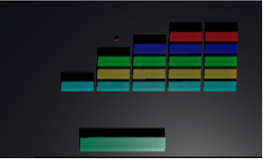

# Breakout-Game
# Introduction
This project is developed based on Unity 3D. The user controls the left and right keys to move the paddle to play. When the ball strikes the bricks, it will disappear. The user is expected to destroy all bricks using the ball. If the Ball falls beneath the paddle, the game will be reset. A screenshot of the play is below.

  

